# Disponibilidade de Serviços Replicados
### Alunos:
Alanis Aguiar Bitencourt | 2315059

Gabriel Costa Castro | 2314515

Lívia Catarina Macêdo | 2315085

---

Este projeto foi desenvolvido para a disciplina de **Programação Distribuída** e tem como objetivo analisar a disponibilidade de um serviço replicado em múltiplos servidores.

O estudo considera um sistema composto por **n servidores independentes**, onde cada servidor possui uma probabilidade **p** de estar disponível em um determinado instante. O serviço é considerado operacional quando **pelo menos k servidores** estão disponíveis.

## Tecnologias Utilizadas

- Python
- Pandas
- Matplotlib

# Exercício 1.1 - Fórmula da disponibilidade
Considere um serviço replicado em **n servidores**.
- Cada servidor possui probabilidade **p** de estar disponível.
- O sistema funciona se pelo menos k servidores estiverem disponíveis.

## Modelagem Probabilística
Para modelar o problema, consideramos que cada servidor pode estar em dois estados:
- Disponível (online) com probabilidade **p**
- Indisponível (offline) com probabilidade **1 − p**

Assumimos que os servidores são independentes, ou seja, o estado de um servidor não influencia o estado dos outros.

Seja:
X = número de servidores disponíveis.

Essa variável aleatória segue uma Distribuição Binomial:

X ~ Binomial(n, p)

A probabilidade de exatamente i servidores estarem disponíveis é dada por:

P(X = i) = C(n,i) · p^i · (1 − p)^(n − i)

onde:

C(n,i) = n! / (i! (n − i)!) -> representa o número de maneiras de escolher i servidores disponíveis dentre n servidores.

## Fórmula Geral da Disponibilidade

Como o sistema precisa de pelo menos k servidores disponíveis, devemos somar as probabilidades de todos os casos possíveis onde o número de servidores disponíveis é maior ou igual a k.

Portanto, a disponibilidade do sistema é:

A(n,k,p) = Σ (i = k até n) C(n,i) · p^i · (1 − p)^(n − i)

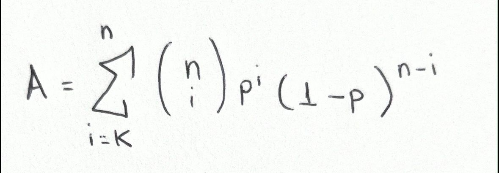

Essa fórmula representa a probabilidade de que k ou mais servidores estejam disponíveis simultaneamente.

# Casos Extremos
## Caso 1) k = n
Neste caso, todos os servidores precisam estar disponíveis para que o sistema funcione.

Como cada servidor tem probabilidade **p** de estar disponível e os servidores são independentes:

- Probabilidade do servidor 1 estar disponível = p  
- Probabilidade do servidor 2 estar disponível = p  
- ...  
- Probabilidade do servidor n estar disponível = p  

Logo, a probabilidade de todos estarem disponíveis simultaneamente é:

A = p · p · p · ... · p

Portanto:

A(n,n,p) = p^n

## Caso 2) k = 1

Neste caso, o sistema precisa de pelo menos um servidor disponível.

É mais fácil calcular o evento complementar, que é o caso em que nenhum servidor está disponível.

- Probabilidade de um servidor não estar disponível = (1 − p)
- Probabilidade de todos os n servidores não estarem disponíveis:

(1 − p)^n

Logo, a probabilidade de pelo menos um servidor estar disponível é:

A(n,1,p) = 1 − (1 − p)^n

# Exercício 1.2 - Cálculo Analítico e Simulação

Após derivar as fórmulas analíticas, implementamos um programa em Python para:

1. Calcular a disponibilidade usando a fórmula matemática.
2. Estimar a disponibilidade através de **simulação estocástica**.

## Cálculo Analítico

O cálculo analítico utiliza diretamente a fórmula:

A(n,k,p) = Σ (i = k até n) C(n,i) · p^i · (1 − p)^(n − i)

Para diferentes valores de:

- **n** → número de servidores
- **k** → número mínimo necessário
- **p** → probabilidade de disponibilidade

Foram analisados principalmente os seguintes casos:

- k = 1  
- k = ⌈n / 2⌉  
- k = n  

## Simulação Estocástica

Além do cálculo analítico, foi implementado um simulador que executa várias rodadas de teste.

Para cada rodada:

1. Para cada servidor é gerado um número aleatório entre **0 e 1**.
2. Se o valor gerado for **menor ou igual a p**, o servidor é considerado **disponível**.
3. Conta-se quantos servidores estão disponíveis.
4. Se o número de servidores disponíveis for **maior ou igual a k**, o serviço é considerado **operacional**.

Após um grande número de rodadas, calculamos a **frequência experimental da disponibilidade**:

Disponibilidade experimental =  
número de rodadas bem sucedidas / número total de rodadas

## Dados e Gráficos
Para avaliar o comportamento da disponibilidade do sistema, foram gerados resultados utilizando duas abordagens:
- **Cálculo analítico**, baseado na fórmula da distribuição binomial.
- **Simulação estocástica**, utilizando geração de números aleatórios para simular o estado de cada servidor.

Os experimentos foram realizados considerando diferentes valores de:
- **n** → número de servidores no sistema
- **k** → número mínimo de servidores necessários
- **p** → probabilidade de cada servidor estar disponível

Os resultados obtidos foram armazenados no arquivo:
dados/resultados.csv

Esse arquivo contém os valores analíticos e experimentais utilizados para gerar os gráficos:

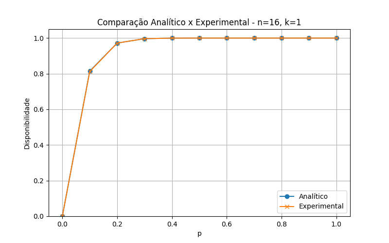 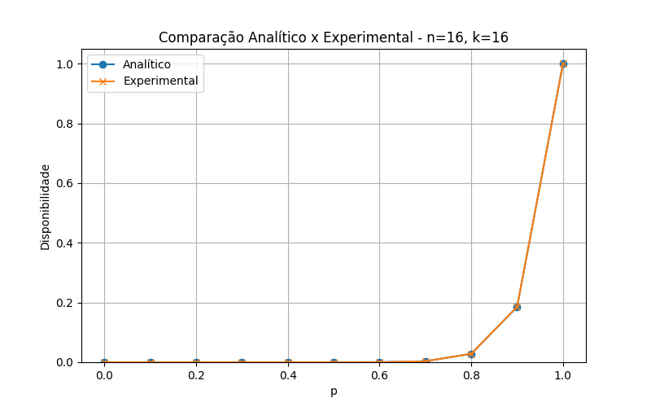 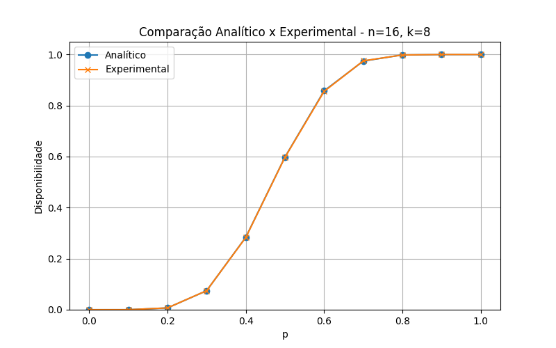 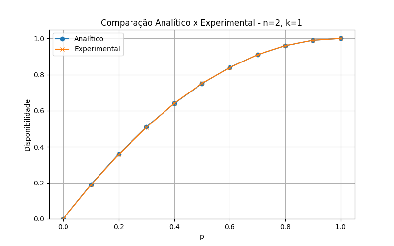 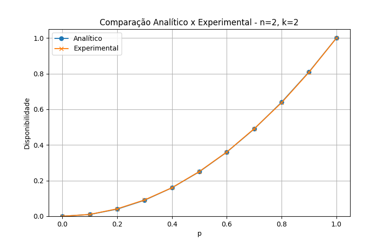 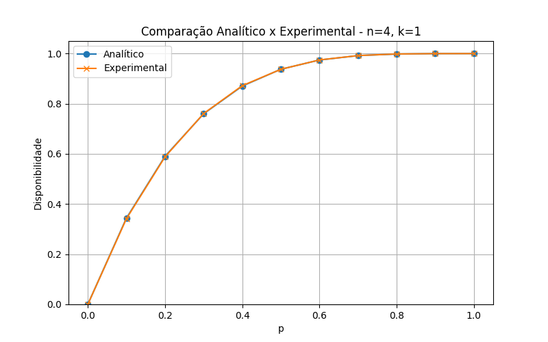 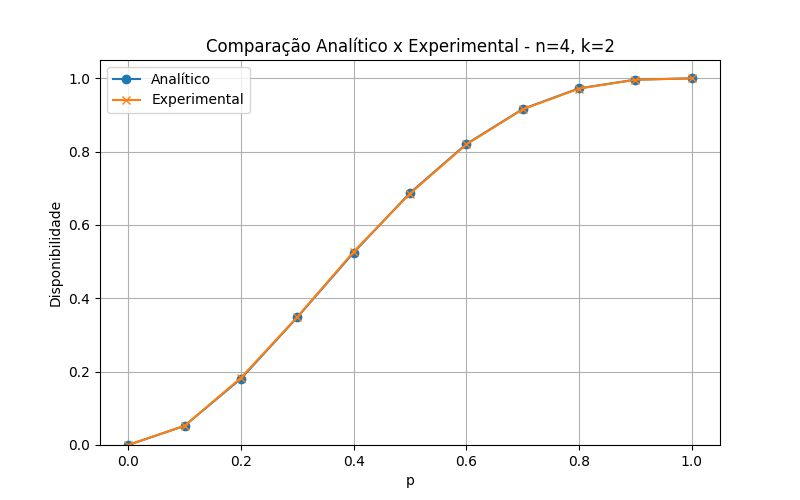 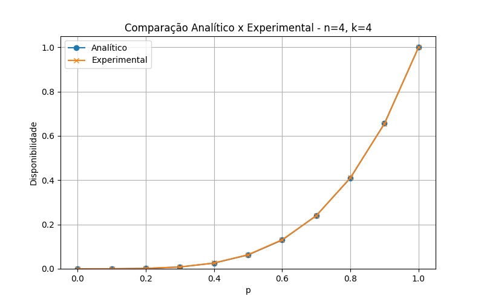 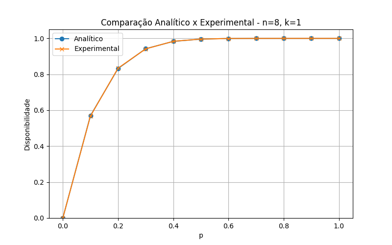 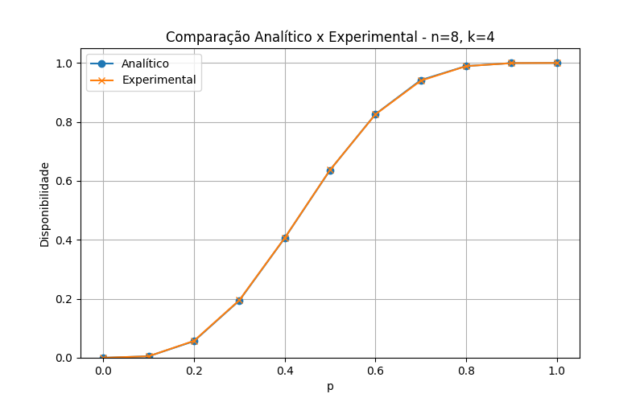 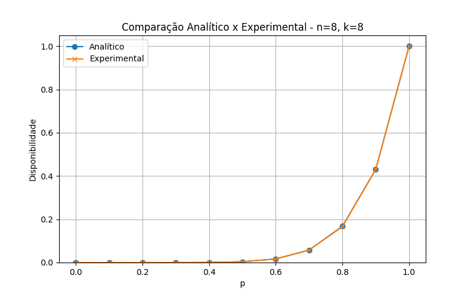

### Gráficos Analíticos
Além da comparação entre teoria e simulação, também foram gerados gráficos analíticos que mostram o comportamento da disponibilidade do sistema para diferentes valores de **n** e **k**.

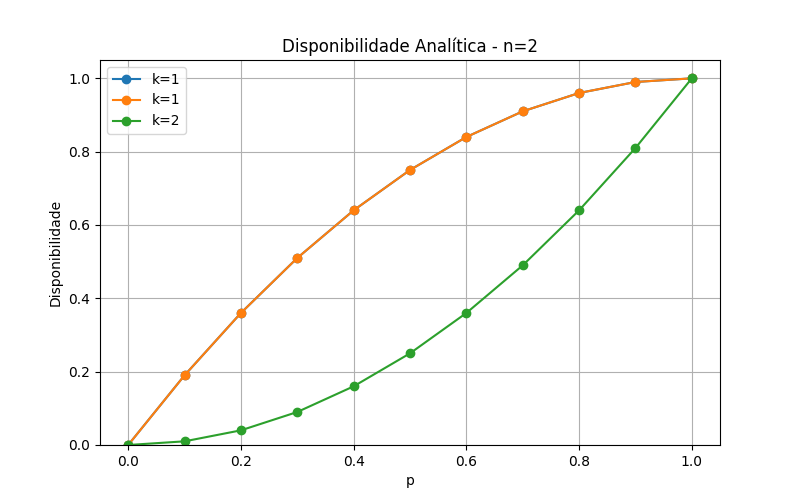
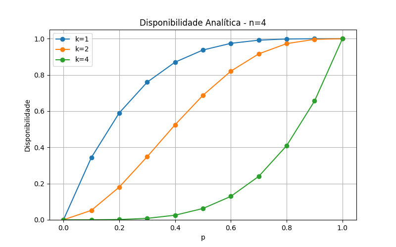

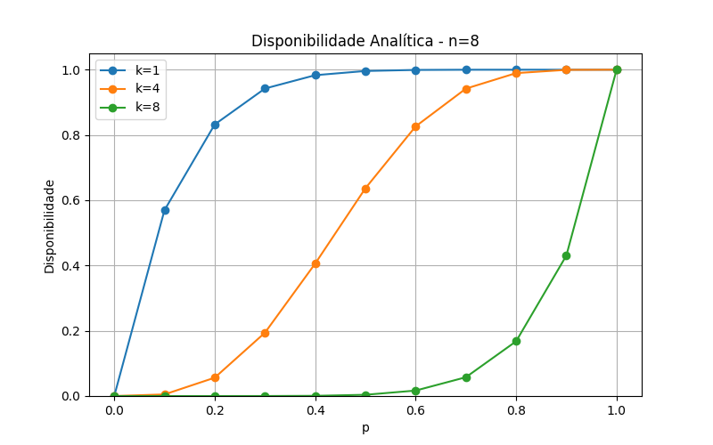
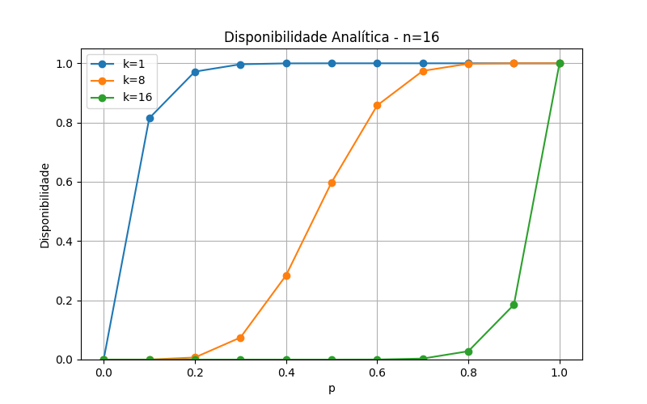

Esses gráficos mostram como a disponibilidade do sistema varia de acordo com a probabilidade **p** de cada servidor estar disponível.

## Interpretação dos Resultados
A análise dos gráficos permite observar alguns comportamentos importantes:

- Quando **k = 1**, a disponibilidade cresce rapidamente conforme aumentamos o número de servidores.
- Quando **k = n**, a disponibilidade depende diretamente de todos os servidores estarem disponíveis, tornando o sistema mais sensível a falhas.
- Valores intermediários de **k** representam um equilíbrio entre consistência e disponibilidade.
- Os resultados experimentais obtidos pela simulação convergem para os resultados analíticos quando o número de rodadas é grande.

Esses resultados demonstram como a replicação de serviços pode aumentar a disponibilidade em sistemas distribuídos, dependendo da política de quorum adotada.

# Comparação entre Teoria e Simulação

Os resultados obtidos pela simulação são comparados com os resultados analíticos.

Observa-se que:

- Quanto maior o número de rodadas da simulação, mais os resultados experimentais se aproximam dos resultados teóricos.
- Pequenas diferenças podem ocorrer devido à natureza aleatória da simulação.
